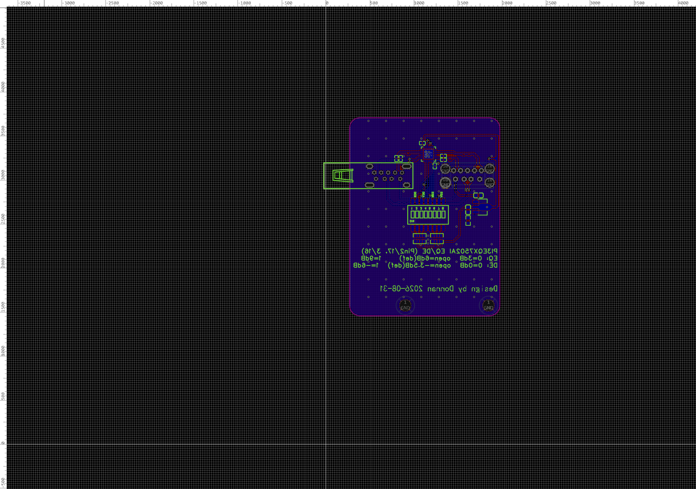
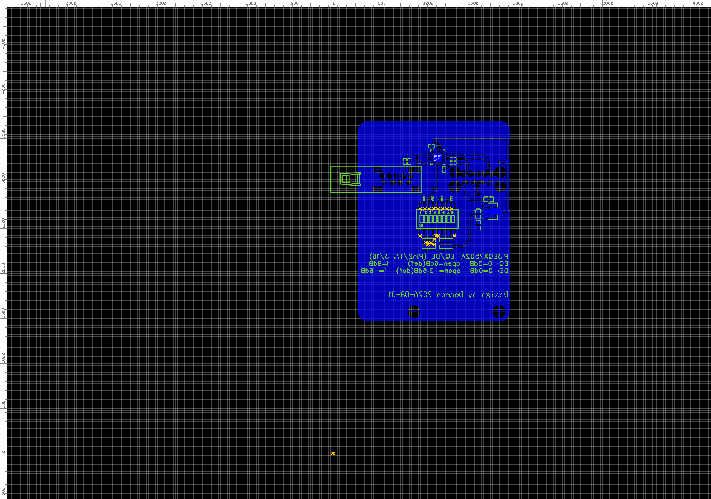
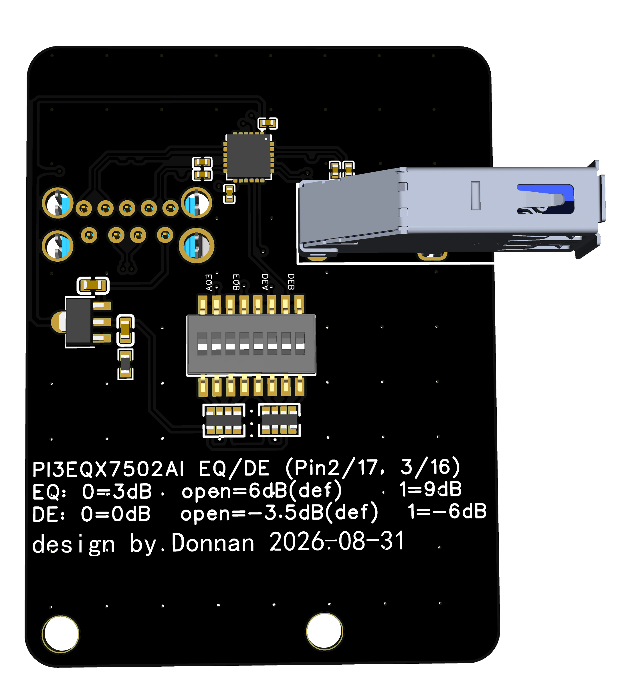

# USB 3.0 ReDriver 中继板（PI3EQX7502）

> 用于 Jetson Orin 平台的 USB 3.0 信号中继扩展板 —— 解决长线缆下 USB 3.0 链路训练失败、降级到 USB 2.0 的问题。


| PCB 顶层 | PCB 底层 | 3D 预览 |
| :------: | :------: | :-----: |
|  |  |  |

板子尺寸 43.59 × 57.42 mm，双层板。

| 内容                              | 路径                                                                                             |
| ------------------------------- | ---------------------------------------------------------------------------------------------- |
| 原理图 PDF / 矢量 SVG                 | [`hardware/schematic.pdf`](hardware/schematic.pdf) · [`schematic.svg`](hardware/schematic.svg)  |
| 物料清单（带立创编号，可直接下单）                | [`hardware/BOM.csv`](hardware/BOM.csv)                                                        |
| Gerber 制板文件                     | [`hardware/gerber/Gerber_PCB2_4_2026-09-01.zip`](hardware/gerber/Gerber_PCB2_4_2026-09-01.zip) |
| EasyEDA 工程源文件（.epro2）            | [`hardware/source/`](hardware/source)                                                          |
| 3D 模型（STEP）                     | [`hardware/3d/`](hardware/3d)                                                                  |

直接下载 Gerber 压缩包就能下单打板，不需要打开 EDA 软件。

## 目录

- [一、这个项目解决什么问题](#一这个项目解决什么问题)
- [二、核心规格](#二核心规格)
- [三、信号链路与方向定义](#三信号链路与方向定义)
- [四、硬件设计详解](#四硬件设计详解)
  - [4.1 ReDriver 配置电路（EQ / DE 三电平）](#41-redriver-配置电路eq--de-三电平)
  - [4.2 电源设计](#42-电源设计)
  - [4.3 AC 耦合电容](#43-ac-耦合电容)
  - [4.4 USB 2.0 通道的处理](#44-usb-20-通道的处理)
- [五、PCB 设计](#五pcb-设计)
- [六、BOM 物料表](#六bom-物料表)
- [七、接口与引脚定义](#七接口与引脚定义)
- [八、组装与焊接](#八组装与焊接)
- [九、使用说明](#九使用说明)
- [十、实测结果](#十实测结果)
- [十一、已知问题与改进建议](#十一已知问题与改进建议)
- [十二、复刻指南](#十二复刻指南)
- [十三、开源协议](#十三开源协议)
- [十四、版本历史](#十四版本历史)

---

## 一、这个项目解决什么问题

做机器人时经常遇到这种情况：Jetson Orin 装在机身内部，深度相机等 USB 3.0 外设却要装在外壳或机械臂末端，用户接口还得通过转接线 + 接口板的方式对外输出。外接线缆一长，5 Gbps 的 SuperSpeed 信号衰减到链路训练失败，主机自动回落到 USB 2.0 —— 设备能识别，但跑不动 USB 3.0。

**典型症状**：设备能被识别，`lsusb -t` 里却挂在 `480M` 而不是 `5000M` 下，相机掉帧、跑不满分辨率。

| 方案                      | 优点              | 缺点              |
| ----------------------- | --------------- | --------------- |
| 有源光缆 AOC                | 可靠，距离长（10~50 m） | 贵，线缆硬           |
| 光纤延长器                   | 距离最长            | 最贵，两端供电         |
| **无源线缆 + ReDriver 中继板** | **便宜，线缆柔软**     | 距离有限（本项目实测 3 m） |

本项目选第三种：串一颗 USB 3.0 ReDriver 在链路中间，对衰减信号做**均衡（EQ）+ 整形 + 去加重（DE）**后重新驱动出去，相当于给信号"续一程"。

> **注意**：ReDriver 只做模拟信号调理，不做协议层重定时（那是 Retimer 的活），所以它不能消除抖动累积。

---

## 二、核心规格

| 项目    | 参数                                                 |
| ----- | -------------------------------------------------- |
| 主控芯片  | PI3EQX7502AIZDEX（Diodes，原 Pericom）                 |
| 支持速率  | USB 3.2 Gen 1 / USB 3.0，5 Gbps                     |
| 通道数   | 2 条独立 5 Gbps 差分对（一收一发，构成 1 个 USB 3.0 口）            |
| 差分阻抗  | 100 Ω CML I/O                                      |
| 主机侧接口 | U11 — HC-USB3.0-L257-P，USB 3.0 Type-A 母座（板边侧插）     |
| 外设侧接口 | USB5 — GSB412137CHR，USB 3.1 Gen 2 Type-A 母座 9P（立式） |
| 供电    | 取自 USB VBUS（5 V），板载 AMS1117-3.3 降为 3.3 V           |
| 配置方式  | 8 位拨码开关 + 4.7 kΩ 排阻，实现 EQ / DE 三电平                 |
| PCB   | 2 层，43.59 × 57.42 mm，1.6 mm FR-4                   |
| 安装    | 2 × M3 螺丝孔，孔距 24.0 mm                              |
| 实测距离  | 3 m（板子 ↔ 外设）                                       |

### ⚠️ 主芯片采购风险

**PI3EQX7502AI 已被 Diodes 标记为 NRND（不建议用于新设计）**，随时可能停产。数据手册首页直接点名了替代型号：

> 原文：*"Not Recommended for New Design, **Use PI3EQX7741AI**"*

- 新项目选型建议直接看 **PI3EQX7741AI**（需自行核对引脚兼容性，本项目未验证）；
- 复刻前确认 LCSC（C526708）库存；
- 自用 / 学习的话，7502 的库存货完全够用。

本文数据均来自官方数据手册 **DS41855 Rev 1-3（2019-04）**。

---

## 三、信号链路与方向定义

USB 3.0 在 USB 2.0 的 4 根线之外，增加了两组 SuperSpeed 差分对。命名是**相对于设备自身**的：`SSTX±` = 本端发送，`SSRX±` = 本端接收。所以 Host 的 SSTX 要接到 Device 的 SSRX（交叉）。

| 通道       | ReDriver 输入          | ReDriver 输出          | 方向      | 承载信号                        |
| -------- | -------------------- | -------------------- | ------- | --------------------------- |
| **A 通道** | `RXA±`（U3 pin 8/9）   | `TXA±`（U3 pin 22/23） | 外设 → 主机 | 上行，输出经 C3/C4 到 `U11.SSTX±`  |
| **B 通道** | `RXB±`（U3 pin 19/20） | `TXB±`（U3 pin 11/12） | 主机 → 外设 | 下行，输出经 C1/C2 到 `USB5.SSTX±` |

完整链路：

```
下行  Orin.SSTX± → [30cm] → U11.SSRX± → U3.RXB± →[B通道]→ U3.TXB± → C1/C2 → USB5.SSTX± → [3m 长线] → 外设.SSRX±
上行  外设.SSTX± → [3m 长线] → USB5.SSRX± → U3.RXA± →[A通道]→ U3.TXA± → C3/C4 → U11.SSTX± → [30cm] → Orin.SSRX±
```

- **U11（host 侧）**：板边侧插，开口朝板外，用短线连 Orin。
- **USB5（外设侧）**：板上立式，开口朝上，外设插上来。

> 两个座子都是 Type-A 母座，说明这块板是**串在链路中间**的，不是终端接口。

---

## 四、硬件设计详解

### 4.1 ReDriver 配置电路（EQ / DE 三电平）

PI3EQX7502 有 4 个配置脚，都是**三电平**输入：

| 引脚              | Pin    | 功能                             | 电平    |
| --------------- | ------ | ------------------------------ | ----- |
| `EQ_A` / `EQ_B` | 2 / 17 | 通道 A / B 输入均衡，补偿**输入之前**的线缆损耗  | L/M/H |
| `DE_A` / `DE_B` | 3 / 16 | 通道 A / B 输出去加重，补偿**输出之后**的线缆损耗 | L/M/H |

```
前一段信道          ReDriver                 后一段信道
───[线缆]──► RX± ──[EQ 均衡]──►[驱动]──►[DE 去加重]──► TX± ───[线缆]──►
             补偿"前面"的损耗      补偿"后面"的损耗
```

**一句话记住：长线在哪一侧，就把那一侧的档位调大。**

三电平门限：`L` < 0.2 V<sub>DD</sub>、`M` 0.4~0.6 V<sub>DD</sub>、`H` > 0.8 V<sub>DD</sub>。芯片内部会把悬空脚偏置到 0.5 V<sub>DD</sub>，所以**什么都不接 = M 档**。

#### 本板的拨码实现

每个配置脚分配 SW1 的 **2 位**（一位上拉 3V3、一位下拉 GND，各串 4.7 kΩ），比焊固定电阻灵活：

| 配置脚    | 上拉位 | 下拉位 |
| ------ | --- | --- |
| `EQ_A` | 位 8 | 位 7 |
| `DE_A` | 位 4 | 位 3 |
| `EQ_B` | 位 6 | 位 5 |
| `DE_B` | 位 2 | 位 1 |

档位组合：**H** = 上拉 ON / 下拉 OFF；**M** = 都 OFF；**L** = 上拉 OFF / 下拉 ON。（都 ON 会分压到 1.65 V，等效 M，但白白耗电 350 µA，不推荐。）

各档位数值（数据手册 "Mode Adjustment" 表）：

| 档位          | EQ 均衡量   | DE 去加重量     |
| ----------- | -------- | ----------- |
| **L**       | 3 dB     | 0 dB        |
| **M**（芯片默认） | **6 dB** | **−3.5 dB** |
| **H**       | 9 dB     | −6 dB       |

注意：EQ 没有 0 dB 档，最小 3 dB；DE 的 dB 是负值，表示对输出摆幅的衰减。

#### 实测配置（已验证）

```
SW1:  [1]=ON  [2]=OFF [3]=OFF [4]=OFF [5]=OFF [6]=OFF [7]=ON  [8]=OFF
      DE_B=L          DE_A=M          EQ_B=M          EQ_A=L
       0 dB            -3.5dB           6dB             3dB
```

即**位 1、位 7 ON，其余 OFF**。这个配置与同工程 V0.7 四路版本（用固定电阻 pinstrap，标注 `n'c'c` 的不贴）推出的结果完全一致 —— 两条独立路径互相印证。

> ✅ 已实测：30 cm 公转公接 Orin + 3 m 公转 Micro-B 接 RealSense D450，稳定跑在 5 Gbps。

#### 💡 实测够用，但理论上有优化空间

长线在外设侧，按理说该把 `EQ_A`（补上行输入）和 `DE_B`（补下行输出）调大，可实测配置在这两处都取了最小值（3 dB / 0 dB），理论上还有 3~6 dB 空间 —— **但 3 m 照样稳**。

原因：ReDriver 的中继增益本身就够，它把输入恢复到满摆幅（典型 1000 mV）再驱动出去，这段"白赚"的增益已覆盖 3 m 损耗。EQ/DE 是锦上添花。

想压更远（4~5 m+）时，先试这个组合：

```
SW1:  [1]=OFF [2]=ON  [3]=OFF [4]=OFF [5]=OFF [6]=OFF [7]=OFF [8]=ON
      DE_B=H          DE_A=M          EQ_B=M          EQ_A=H
       -6dB            -3.5dB           6dB             9dB
```

> EQ 不是越大越好，开太大会连噪声一起放大。H 档反而变差就退回 M。

#### 另外三个配置脚 —— 悬空是正确的

| 引脚                | Pin     | 内部电阻          | 悬空状态          |
| ----------------- | ------- | ------------- | ------------- |
| `EN_A#` / `EN_B#` | 10 / 21 | 200 kΩ **下拉** | 逻辑 0 → 通道使能   |
| `RxD_EN`          | 5       | 200 kΩ **上拉** | 逻辑 1 → 接收检测激活 |

数据手册确认：**悬空是设计意图，不是遗漏**，正好落在配置表的最佳状态（Chip and channel enabled, receiver detect is active）。需要用 GPIO 控制低功耗时才把这些脚引出来。

芯片还有自适应功耗管理：信号检测器空闲 > 1.3 ms 进低功耗；低功耗下再空闲 > 6 ms 重启接收检测循环。设备拔掉会自动省电，无需干预。

---

### 4.2 电源设计

```
U11 VBUS +5V ──┬──► C19 (10µF) ──► GND              输入滤波
               └──► U1 (AMS1117-3.3S, SOT-89-3) ──► 3V3
                      ├──► C18 (22µF) ──► R12 ──► GND     阻尼
                      ├──► C5, C6 (100nF) ──► GND         去耦
                      └──► U3 pin 1 / pin 13 (Vdd33)
```

- **供电来源**：host 侧 VBUS 取 5 V，无需外接电源。注意这路和外设供电共用，USB 3.0 端口标准供电 900 mA，外设功耗大时要留余量。
- **C18 + R12 阻尼**：AMS1117 这类老架构 LDO 对输出电容 ESR 有要求（0.1~10 Ω），MLCC 的 ESR 太低会振荡。所以在 22 µF 陶瓷电容接地路径串一颗小电阻（R12）人为抬高 ESR，取值 **1 Ω**（富捷 FRC0603F1R00TS）。
- **U3 有两组 Vdd33（pin 1 和 13）**，都要去耦到。

功耗（数据手册实测值）：

| 模式            | 条件          | 典型值        | 最大值    |
| ------------- | ----------- | ---------- | ------ |
| **Active**    | 通道使能且有信号    | **328 mW** | 450 mW |
| Slumber       | 通道使能，无信号    | —          | 65 mW  |
| Device Unplug | 输出未端接       | 7.3 mW     | —      |
| Standby       | `EN_x#` = 1 | 0.15 mW    | 1.8 mW |

Active 电流最大 125 mA（典型 99 mA）。加上 LDO 损耗约 168 mW，板子 5 V 侧总功耗约 **496 mW**，从 VBUS 抽约 **99 mA**。SOT-89-3 热阻约 100~~150 °C/W，温升 17~~25 °C；装在密闭高温环境里建议给 U1 多铺铜。

---

### 4.3 AC 耦合电容

USB 3.0 规范要求 SuperSpeed 差分对串 AC 耦合电容，推荐 **100 nF**。本板 4 颗 100 nF 0402：C1/C2 在 `U3.TXB±`→`USB5.SSTX±`，C3/C4 在 `U3.TXA±`→`U11.SSTX±`。

**为什么只在 ReDriver 输出侧放？** 因为规范规定**隔直电容由发送端提供** —— Host 和 Device 送出来的信号内部已经隔直过了，而 ReDriver 自己的 CML 输出带直流偏置，必须由它自己提供。输入侧再加会和内部 50 Ω 端接形成额外高通，劣化低频响应。

布局要求：靠近 ReDriver 输出脚、0402 小封装、两颗对称摆放、正下方地平面不要挖空。

> **好消息**：数据手册明确写了输入输出引脚都 **pin polarity reversible**，差分对正负接反也能正常工作。布线绕不开时直接交叉走线即可，不用打过孔换层。

---

### 4.4 USB 2.0 通道的处理

D+ / D− 从 U11 直连到 USB5，**不经过 ReDriver**。原因：480 Mbps 衰减小，3 m 完全够用；且 USB 2.0 是半双工双向的同一对线，单向 ReDriver 没法中继。实测也印证了 —— 直连时设备能识别（只是跑 480M），说明 USB 2.0 通道从头到尾都通。

---

## 五、PCB 设计

| 项目           | 值                    | 项目     | 值                 |
| ------------ | -------------------- | ------ | ----------------- |
| 层数           | 2（Top / Bottom）      | 默认信号线宽 | 10 mil            |
| 板框尺寸         | **43.59 × 57.42 mm** | 电源线宽   | 20 mil            |
| 走线 / 过孔 / 焊盘 | 242 / 93 / 106       | 间距     | 5.98 mil          |
| 铺铜           | 顶层 + 底层均铺 GND        | 过孔     | 外径 24 / 孔径 12 mil |

安装孔（M3，接 GND，孔距 24.0 mm）：SCREW4 (16.21, 3.13 mm)、SCREW3 (40.21, 3.13 mm)，坐标相对板框左下角。

板上定义了 7 组差分对：DP45（USB2.0 D±）、DP60/DP61/DP62（B 通道）、DP63/DP64/DP65（A 通道）。其中 DP60 的极性标注反了，但芯片支持极性反转，**不影响功能**，仅为规范起见建议改正负端网络名。

**走线长度与对内等长**（仅 PCB 部分）：

| 差分对         | 正端       | 负端       | 对内偏差         |
| ----------- | -------- | -------- | ------------ |
| TXA±        | 4.17 mm  | 4.17 mm  | **0.00 mil** |
| TXB±        | 7.67 mm  | 7.64 mm  | 1.18 mil     |
| RXA±        | 17.20 mm | 17.23 mm | 0.84 mil     |
| RXB±        | 16.89 mm | 16.77 mm | 4.92 mil     |
| D± (USB2.0) | 36.68 mm | 36.53 mm | 5.65 mil     |

最大的 4.92 mil 换算成时间只有 0.886 ps，5 Gbps 下 1 UI = 200 ps，仅占 **0.004 UI**，可忽略。

### 阻抗控制的说明

**这块板没有做严格的 90 Ω 差分阻抗控制。** 2 层板在 1.6 mm FR-4 上做 90 Ω 差分需要约 12~~15 mil 线宽配 6~~8 mil 间距，本板差分线宽在 5~~10 mil，实际阻抗偏高（约 100~~120 Ω）。

实测仍能过是因为：板内走线很短（最长 17 mm），反射效应有限；USB 3.0 链路训练有容错；主要瓶颈在线缆不在 PCB。

追求更好性能的话：下单时向板厂明确要求"USB 3.0 差分对按 90 Ω ±10% 阻抗控制"，或直接改 4 层板。

---

## 六、BOM 物料表

整板 18 个器件（含 2 个螺丝孔），实际物料 10 种。

| 位号       | 型号               | 封装                 | 数量 | 立创编号     | 说明                     |
| -------- | ---------------- | ------------------ | -- | -------- | ---------------------- |
| U3       | PI3EQX7502AIZDEX | TQFN-24 (4×4, EP)  | 1  | C526708  | ReDriver，**已 NRND**    |
| U11      | HC-USB3.0-L257-P | USB-3.0-A-TH       | 1  | C7501847 | host 侧 Type-A 母座       |
| USB5     | GSB412137CHR     | USB-TH_9P-P2.00-V  | 1  | C464567  | 外设侧 Type-A 母座          |
| U1       | AMS1117-3.3S     | SOT-89-3           | 1  | C347256  | LDO 5V→3V3             |
| SW1      | DSHP08TSGER      | SW-SMD 16P (P1.27) | 1  | C3293147 | 8 位拨码开关                |
| RN1, RN2 | 4D03WGJ0472T5E   | RES-ARRAY 0603-8P  | 2  | C1980    | 4.7 kΩ × 4 排阻          |
| R12      | FRC0603F1R00TS   | R0603              | 1  | C2907004 | 1 Ω 阻尼电阻                  |
| C1~C6    | CL05B104KO5NNNC  | C0402              | 6  | C1525    | 100 nF（4 AC 耦合 + 2 去耦） |
| C18      | CL10A226MQ8NRNC  | C0603              | 1  | C59461   | 22 µF，LDO 输出           |
| C19      | CL10A106KP8NNNC  | C0603              | 1  | C19702   | 10 µF，LDO 输入           |
| SCREW3/4 | M3 螺丝孔           | —                  | 2  | —        | 安装孔，接 GND              |

**采购提示**：

- U3 优先确认库存（NRND）。
- USB5 是 Amphenol Gen 2 规格座子，插拔寿命 5000 次但价格高（¥10~20），预算紧可换普通 USB 3.0 座（注意 9P / 2.00 mm 间距 / 通孔立式）。**换座子不会让链路跑上 10 Gbps**，瓶颈在只支持 5 Gbps 的 PI3EQX7502。
- 电容建议 X7R 或更好。注意 MLCC 直流偏压效应 —— 22 µF/6.3 V 的 0603 在 3.3 V 偏置下实际容量可能只剩一半。

---

## 七、接口与引脚定义

### U11 — host 侧 Type-A 母座（HC-USB3.0-L257-P）

| Pin | 名称    | 板上连接          | Pin | 名称        | 板上连接             |
| --- | ----- | ------------- | --- | --------- | ---------------- |
| 1   | VBUS  | +5V（板子供电来源）   | 7   | GND_DRAIN | GND              |
| 2   | D−    | 直连 USB5 pin 2 | 8   | SSTX−     | ← C3 ← U3 pin 23 |
| 3   | D+    | 直连 USB5 pin 3 | 9   | SSTX+     | ← C4 ← U3 pin 22 |
| 4   | GND   | GND           | 10  | SHELL     | GND              |
| 5   | SSRX− | → U3 pin 20   | 11  | SHELL     | GND              |
| 6   | SSRX+ | → U3 pin 19   |     |           |                  |

### USB5 — 外设侧 Type-A 母座（GSB412137CHR）

| Pin | 名称    | 板上连接         | Pin | 名称        | 板上连接             |
| --- | ----- | ------------ | --- | --------- | ---------------- |
| 1   | VBUS  | +5V（给外设供电）   | 6   | SSRX+     | → U3 pin 9       |
| 2   | D−    | 直连 U11 pin 2 | 7   | GND_DRAIN | GND              |
| 3   | D+    | 直连 U11 pin 3 | 8   | SSTX−     | ← C1 ← U3 pin 11 |
| 4   | GND   | GND          | 9   | SSTX+     | ← C2 ← U3 pin 12 |
| 5   | SSRX− | → U3 pin 8   | 10  | SHELL     | GND              |

### U3 — PI3EQX7502AIZDEX（TQFN-24）

| Pin        | 名称          | 板上连接                   | 备注             |
| ---------- | ----------- | ---------------------- | -------------- |
| 1          | Vdd33       | 3V3                    | 去耦 C5          |
| 2          | EQ_A        | SW1 位 7/8 经 RN1        | 三电平配置          |
| 3          | DE_A        | SW1 位 3/4 经 RN2        | 三电平配置          |
| 4, 6, 7    | DNC         | 悬空                     | Do Not Connect |
| 5          | RxD_EN      | 悬空                     | 内部 200 kΩ 上拉   |
| 8 / 9      | RXA− / RXA+ | USB5 pin 5 / 6         | A 通道输入（极性可反转）  |
| 10         | EN_A#       | 悬空                     | 内部 200 kΩ 下拉   |
| 11 / 12    | TXB− / TXB+ | → C1/C2 → USB5 pin 8/9 | B 通道输出（极性可反转）  |
| 13         | Vdd33       | 3V3                    | 去耦 C6          |
| 14, 15, 18 | DNC         | 悬空                     | Do Not Connect |
| 16         | DE_B        | SW1 位 1/2 经 RN2        | 三电平配置          |
| 17         | EQ_B        | SW1 位 5/6 经 RN1        | 三电平配置          |
| 19 / 20    | RXB+ / RXB− | U11 pin 6 / 5          | B 通道输入（极性可反转）  |
| 21         | EN_B#       | 悬空                     | 内部 200 kΩ 下拉   |
| 22 / 23    | TXA+ / TXA− | → C4/C3 → U11 pin 9/8  | A 通道输出（极性可反转）  |
| 24         | DNC         | 悬空                     | Do Not Connect |
| 25         | EP 裸焊盘      | GND                    | **必须焊接接地**，兼散热 |

> **DNC 脚必须悬空**，不要接任何网络（包括 GND）。  
> **EP 一定要焊**：它是主要散热路径和内部地参考。建议打 4~9 个 Ø0.3 mm 过孔连到底层 GND，过孔要塞油墨或树脂塞孔，避免回流焊锡膏流失。

---

## 八、组装与焊接

**难度：中等偏上**。主要难点是 U3 的 TQFN-24（0.5 mm 间距 + 中心裸焊盘）和两个通孔 USB 座子。

推荐顺序：

1. **U3（TQFN-24）** —— 最先焊。推荐钢网 + 回流焊 / 加热台，EP 焊盘区锡膏覆盖率控制在 50~70%（太多会把芯片顶起来虚焊）。热风枪也可行，350 °C 均匀加热，EP 需单独补锡或预植锡。焊完测 pin 1/13 对 GND 不短路、对 3V3 导通。
2. **C1~C6、C18、C19、R12** —— 0402 用尖头烙铁，先给一端焊盘上锡，镊子定位后焊一端再焊另一端。
3. **RN1 / RN2（0603-8P 排阻）** —— 引脚密，建议锡膏 + 热风枪，或多锡拖焊 + 吸锡带清理。
4. **SW1（SMD 16P）** —— 间距 1.27 mm 好焊，注意缺口方向与丝印对应。
5. **U11 / USB5（通孔座子）** —— **最后焊**（会挡住周围贴片区）。先插到位确认贴紧板面，焊 1~2 个固定脚定位后再焊完；外壳接地脚多给锡，它承担屏蔽和机械固定。
6. **U1（SOT-89-3）** —— 中间散热焊盘（pin 2 延伸）要上好锡。

焊后检查：3V3 对 GND 阻抗不应接近 0 → 插 USB 测 U3 pin 1 应为 3.3 V ±5% → 通电 1 分钟摸 U3 微温正常、烫手有问题。

---

## 九、使用说明

### 接线

```
Jetson Orin ──30cm USB公转公(A公-A公)──► U11 ──► ReDriver ──► USB5 ──3m USB公转Micro-B──► RealSense D450
```

1. 用 USB **公转公（A公-A公）** 线把 **U11** 接 Orin 的 USB-A 口（实测 30 cm）；
2. 用标准 USB 3.0 线把外设接 **USB5**（实测 3 m 的 A公转 Micro-B）；
3. 无需外接电源，从 host 侧 VBUS 取电。

> **那根 A公-A公线是最常见的坑**：不符合 USB-IF 规范，市售产品内部接法不统一。好消息是实测 30 cm 的可用。接上没反应就先换线、或两端插头对调试试。

### 确认链路速率

```bash
lsusb -t
```

看最后那个数字：**`5000M`** ✅ 链路正常 | **`480M`** ❌ 降级了。

看到 480M 时按顺序排查：① 换 U11 那根 A公-A公线；② 测 U3 pin 1 是否为 3.3 V 确认上电；③ 调 SW1 的 EQ/DE 档位；④ 缩短外设侧线缆确认是否超限。

### 调整 EQ / DE

拨码对照：`EQ_A` 上拉位 8 / 下拉位 7，`DE_A` 位 4 / 位 3，`EQ_B` 位 6 / 位 5，`DE_B` 位 2 / 位 1。  
档位：**H** = 上拉 ON；**M** = 都 OFF；**L** = 下拉 ON。

调参思路：

- 长线在**外设侧**（本项目）→ 加大 `EQ_A` + `DE_B`
- 长线在**主机侧** → 加大 `EQ_B` + `DE_A`
- 链路不稳 → EQ 往上调（3 → 6 → 9 dB）
- 过冲 / EMI → DE 往下调（−6 → −3.5 → 0 dB）

**每次只改一个配置脚**，改完记录。拨码不需要断电（纯电平配置，实时生效），但链路会重新训练，外设会短暂断开重连。

---

## 十、实测结果

| 项目    | 内容                                                                     |
| ----- | ---------------------------------------------------------------------- |
| 主机    | Jetson Orin，USB 3.0 Type-A 母座                                          |
| 主机侧线缆 | 30 cm，USB 公转公（A公-A公）→ `U11`                                            |
| 外设侧线缆 | 3 m，USB 公转 Micro-B → `USB5`                                            |
| 外设    | Intel RealSense Depth Module D450 深度相机                                 |
| 板载配置  | `EQ_A`=L(3dB)、`DE_A`=M(−3.5dB)、`EQ_B`=M(6dB)、`DE_B`=L(0dB)，即位 1、位 7 ON |

**关于 D450**：立体视觉（Active IR Stereo）+ RGB，全局快门，深度最高 1280×720@30fps，FOV 86°×57°，基线 50 mm，接口 USB 3.1。双目 + RGB 同时传流，对带宽和稳定性要求高，是很合适的测试对象。

### 对比结果

| 场景                    | 结果                               |
| --------------------- | -------------------------------- |
| 不加 ReDriver 板，3 m 线直连 | ❌ 能识别，但**降级到 USB 2.0（480 Mbps）** |
| 串入 ReDriver 板         | ✅ 正常跑在 **USB 3.0（5 Gbps）**       |

同样一根 3 m 线，串上板子从 480M 变 5000M，带宽提升约 10 倍 —— 对深度相机就是"能不能跑满分辨率和帧率"的分界线。

### 复刻后的验证顺序

1. 短线直连（< 1 m）确认主机和外设本身正常；
2. 长线直连（3 m）复现降级，作为对照组；
3. 串入本板确认速率回到 5000M；
4. 压力测试：相机满分辨率满帧率连续采集，`dmesg | grep -i usb` 看有无错误；用 RealSense 可直接跑 `realsense-viewer` 看有没有 "Frame didn't arrive"；
5. 按需调参。

### 想压更远距离

1. 先把 `EQ_A` 调到 M/H（6/9 dB）、`DE_B` 调到 M/H（−3.5/−6 dB）—— 免费；
2. 换更好的线缆（线径粗、屏蔽好、带磁环）；
3. 再不行就级联或改用有源光缆（AOC）。注意 ReDriver 不做重定时，级联抖动会累积，一般不超过两级。

---

## 十一、已知问题与改进建议

这些问题都不影响已实测的功能，但复刻或改进时值得知道。

### 设计 / 电气

| 编号   | 问题                                         | 影响                        | 建议                    |
| ---- | ------------------------------------------ | ------------------------- | --------------------- |
| E-1  | **PI3EQX7502AI 已 NRND**                    | 采购风险                      | 备货，或评估 PI3EQX7741AI   |
| E-2  | EQ/DE 补偿没用在最需要的地方（`EQ_A`=3 dB、`DE_B`=0 dB） | **实测 3 m 稳定可用**，只是眼图裕量非最优 | 3 m 内不必动；想压更远时把这两项往上推 |
| E-3' | 未引出 `EN_x#` 控制脚                            | 无法用 GPIO 强制低功耗            | 需要时把 pin 10/21 引到排针   |
| E-5  | **未做 90 Ω 差分阻抗控制**                         | 板内阻抗偏高，短走线下影响有限           | 向板厂提阻抗要求，或改 4 层板      |
| E-6  | 3V3 走线细长（101.6 mm / 10 mil）                | 压降和噪声裕量偏小                 | 改铺铜，或加宽到 15~20 mil    |
| E-7  | `+5V` / `3V3` 未铺铜                          | 同上                        | 用铺铜替代细走线              |

> ~~E-3（`EN_A#`/`EN_B#`/`RxD_EN` 悬空）~~ ✅ 已澄清不是问题：芯片内部各带 200 kΩ 上下拉，悬空正好落在最佳工作状态。

### PCB / 制板

| 编号             | 问题                   | 数量          | 影响               | 建议           |
| -------------- | -------------------- | ----------- | ---------------- | ------------ |
| ~~P-1 / P-1'~~ | ~~底层丝印未镜像 + 位号朝向不正~~ | ~~52+13 处~~ | ✅ **已修复**（见文末附记） | —            |
| P-2            | 焊盘上走线                | 8 处         | 影响焊接良率           | 走线终止在焊盘边缘    |
| P-3            | 盘中孔                  | 5 处         | 漏锡虚焊             | 改盘外打孔或树脂塞孔   |
| P-4            | 3W 间距不足              | 38 处        | 高速信号串扰           | 拉开间距至少 3 倍线宽 |
| P-5            | 45° 锐角走线             | 5 处         | DFM 报警，实际影响很小    | 可接受，也可改圆弧    |
| P-6            | 丝印压焊盘                | 10 处        | 影响焊接             | 挪开丝印         |
| P-7            | 线宽低于规格               | 1 处         | 载流 / 生产风险        | 加宽到符合规则      |

### 原理图

| 编号  | 问题                        | 数量   | 影响                   | 建议                    |
| --- | ------------------------- | ---- | -------------------- | --------------------- |
| S-1 | 零长度导线                     | 20 条 | 冗余图元                 | 删除                    |
| S-2 | 差分对 DP60 极性标注反了           | 1 处  | 仅影响 EDA 命名（芯片支持极性反转） | 改正负端网络名               |
| S-3 | D± 网络是自动命名（$1N380/$1N381） | 2 条  | 可读性差                 | 改 `USB_DP` / `USB_DM` |
| S-4 | 原理图未做功能分区与说明              | —    | 别人看不懂结构              | 按电源 / ReDriver / 接口分区 |

### 功能改进方向

4 层板版本（完整地平 + 可控阻抗）｜加状态指示灯｜跳线控制 `EN_x#`｜改 Type-C 接口｜多路版本（同工程 V0.7 是 4 路 + DP + RJ45）｜预留可断开的测试点方便测眼图。

### 附记：底层丝印修复（2026-08-31 已完成）

最初 52 条底层丝印没镜像，从背面看文字全是反的。成因是器件 flip 到底层时丝印移到了 Bottom Silkscreen 层，但 `mirror` 属性没跟着置位。

修复：47 条器件属性文字用 `eda.pcb_PrimitiveAttribute.modify(id,{mirror:true})`、5 条独立标注用 `eda.pcb_PrimitiveString.modify(id,{mirror:true})`。镜像修好后又暴露 13 个位号朝向不正，把 `rotation` 归一化到 360° 整数倍即可（改 rotation 不移动锚点，位置零偏移）。

结果：`silkFlipped` 55 → **0**，ERROR 52 → **0**，总 issue 124 → 69。

踩过的坑：① `pcb.silk.set` typed action 不接受 `mirror`，必须直接调官方 API；② 连续 mutate 之间要 `doc reload`，否则后续调用返回空；③ 判对错用 `pcb dump` + `pcb check`，别看截图（会 stale）；④ `silkFlipped` 计数与 ERROR 数口径不一致，以 ERROR 归零为准。

---

## 十二、复刻指南

**需要准备**：PCB（2 层 43.6×57.4 mm）、热风枪或加热台、烙铁、万用表、放大镜。

**步骤**：

1. 确认 U3 库存（NRND，先查 C526708）；
2. 取 Gerber：`hardware/gerber/` 下的压缩包直接用它下单。按嘉立创默认工艺即可（追求信号质量就在制板说明加"USB 3.0 差分对按 90 Ω 阻抗控制"）；
3. 按第六节 BOM 备料 → 按第八节焊接 → 按第九节接线验证 → 按第十节做"直连 vs 串板"对比。

**值得改的几处**（按性价比排序）：

1. 调 EQ/DE（零成本，长线在外设侧就把 `EQ_A` 调到 6/9 dB、`DE_B` 调到 −3.5/−6 dB）；
2. `EN_x#` 引出到排针（方便 GPIO 控制低功耗、做开关对比）；
3. 3V3 电源改铺铜；
4. 改 4 层板 + 阻抗控制（成本翻倍，信号质量提升最明显）。

---

## 十三、开源协议

本项目采用 **CERN-OHL-S v2（Strongly Reciprocal）** 授权：

- ✅ 自由使用、修改、制造、销售，可商用；
- ⚠️ 修改后分发（卖成品或发文件）必须以同样协议公开修改版源文件；
- ⚠️ 保留原作者署名和协议声明；
- ❌ 按"原样"提供，不含任何担保。

完整文本：<https://ohwr.org/project/cernohl/wikis/Documents/CERN-OHL-version-2>

> 选强著佐权版的意图是让改进也能回流社区。自己用、不分发则不受限制。

---

## 十四、版本历史

| 版本              | 说明                                                                      |
| --------------- | ----------------------------------------------------------------------- |
| **单路版本（本仓库）**   | 1 × PI3EQX7502 + 8 位拨码配置。工程内原名 `PI3EQX501i`（沿用早期选型，与实际贴装型号不符，已更正）       |
| **V0.7 四路版本**   | 4 × PI3EQX7502，EQ/DE 用固定电阻 pinstrap（`n'c'c` = 不贴），另含 DP 与 RJ45。本板配置继承自此 |
| **V0.7.1 四路版本** | V0.7 的小改版                                                               |

---

## 附录

**工程结构**（嘉立创 EDA 专业版工程 `orin接口扩展`）：

```
├── PI3EQX501i      ← 本仓库对应的板（schematic2_4 + PCB2_4）
├── orin接口扩展V0.7（4*PI3EQX7502）
├── orin接口扩展V0.7。1（4*PI3EQX7502）_1
├── Board1 / Board1_1 / Board2_1
└── 4层测试
```

**参考资料**：

- PI3EQX7502AI 数据手册 — Diodes，DS41855 Rev 1-3（2019-04）。本文的 EQ/DE dB 值、三电平门限、内部上下拉、功耗、引脚定义与极性反转特性均出自此手册
- CERN-OHL-S v2 协议文本
- USB 3.2 规范（USB-IF，SuperSpeed 差分对与 AC 耦合要求）

**反馈**：设计上肯定有疏漏，欢迎反馈。

---

*最后更新：2026-08-31*
